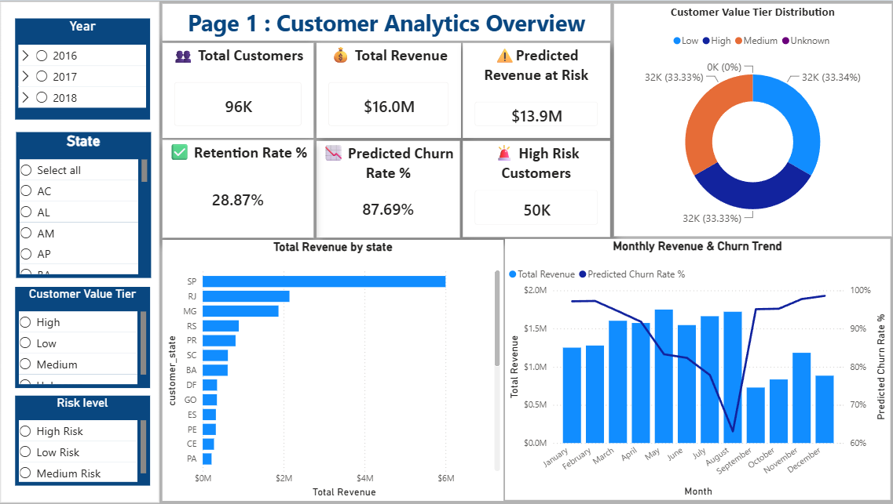
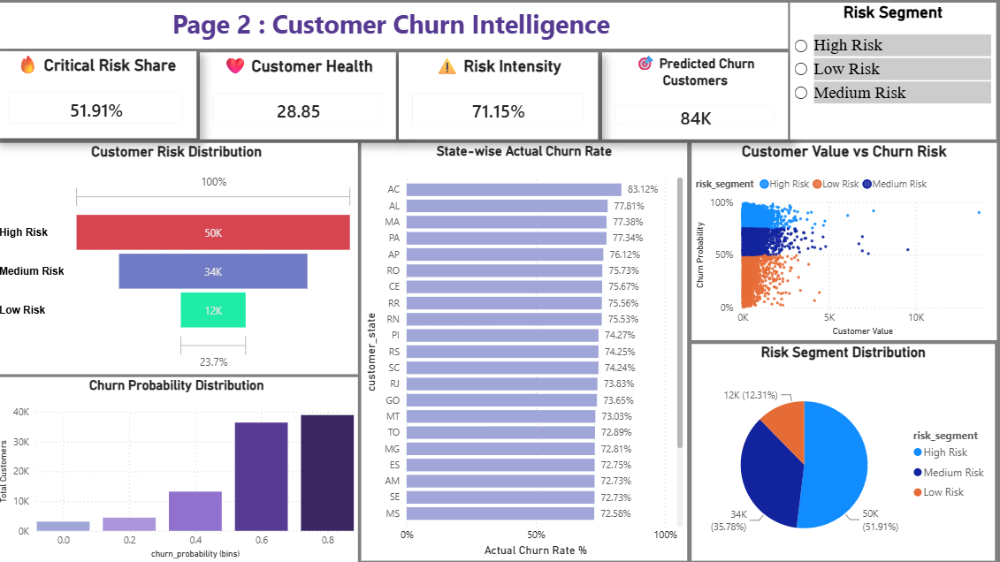
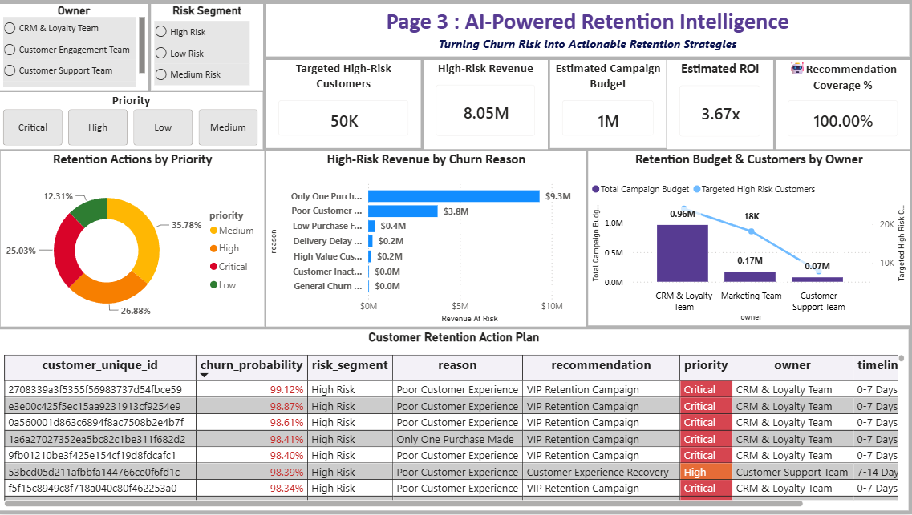

# CustomerPulse AI

## Customer Churn Analysis & Retention Intelligence Platform

CustomerPulse AI is a customer analytics project built using the **Olist Brazilian E-Commerce Dataset**. The project analyses customer purchasing behaviour, customer value, churn risk, and revenue exposure to understand where customer retention requires attention.

The project follows an end-to-end analytics workflow covering data preparation, Customer 360 development, exploratory analysis, PostgreSQL business analysis, customer segmentation, churn prediction, revenue-risk analysis, retention prioritisation, and business dashboards.

---

## Business Problem

In an e-commerce business, customer information is distributed across multiple datasets such as customers, orders, payments, products, sellers, reviews, and delivery records.

Analysing these sources separately makes it difficult to answer business questions such as:

- Which customers are more likely to churn?
- Which customers contribute the most revenue?
- How much revenue is associated with customers at risk?
- Which customer groups require greater retention attention?
- What customer behaviour is associated with churn risk?
- How can customer-level analysis support retention decisions?

CustomerPulse AI brings these customer, transaction, behavioural, value, and risk signals together into a customer-level analytical view.

---

## Project Objective

The objective is to build a customer-level analytical framework that helps a business:

- Understand customer purchasing behaviour
- Measure customer value
- Identify churn risk
- Estimate revenue exposure
- Segment customers based on risk and value
- Prioritise customers for retention analysis
- Translate analytical findings into retention actions
- Present business findings through interactive dashboards

---

## Dataset

### Olist Brazilian E-Commerce Dataset

The project uses the **Olist Brazilian E-Commerce Dataset**, a public Brazilian e-commerce dataset commonly available through Kaggle.

The dataset contains information related to:

- Customers
- Orders
- Order items
- Payments
- Products
- Sellers
- Reviews

The project integrates relevant datasets to create a customer-level analytical view.

### Final Customer 360 Dataset

The final validated dataset contains:

- **96,096 customer records**
- **49 features**
- **0 missing values**
- **0 duplicate records**

The Customer 360 dataset combines customer information with purchasing, spending, frequency, tenure, review, delivery, payment, value, churn, risk, and retention-related information.

---

## Customer 360

A Customer 360 dataset was developed by consolidating relevant customer and transaction information into a single customer-level analytical dataset.

The feature engineering process covers:

- Customer profile
- Order behaviour
- Total spending
- Purchase frequency
- Customer tenure
- Average order value
- Review behaviour
- Delivery experience
- Payment behaviour
- Customer value
- Churn-related features

After the churn analysis and retention workflow, additional model and business-action features were incorporated, resulting in the final **49-feature Customer 360 dataset**.

---

# Analytical Workflow

## 1. Data Understanding

The Olist datasets were examined individually to understand:

- Dataset structure
- Relationships between tables
- Data types
- Missing values
- Duplicate records
- Business meaning of important fields

---

## 2. Data Cleaning & Validation

The data preparation process included:

- Missing-value analysis
- Duplicate checks
- Data type validation
- Data cleaning
- Dataset integration
- Final validation

The final Customer 360 dataset was validated before being used for downstream analysis.

---

## 3. Customer 360 Development

Relevant customer, transaction, payment, review, delivery, and behavioural information was consolidated into a customer-level dataset.

This created a single analytical view that could be used across:

**EDA → SQL Analysis → Segmentation → Churn Prediction → Revenue Risk → Retention Analysis**

---

## 4. Exploratory Data Analysis

EDA was performed to understand customer behaviour and identify patterns related to:

- Customer spending
- Purchase frequency
- Customer value
- Customer tenure
- Review behaviour
- Delivery experience
- Payment behaviour
- Churn-related characteristics

---

## 5. SQL Business Analysis

**PostgreSQL** was used to perform **20 business-focused SQL analyses** on the Customer 360 data.

The analysis covers areas including:

- Overall customer and revenue performance
- Customer value tier analysis
- State-wise revenue
- State-wise customer risk
- Monthly revenue trends
- Customer acquisition
- Pareto revenue analysis
- High-spending customers with low purchase frequency
- Customer Lifetime Value by value tier
- At-risk customer identification
- Inactive repeat customers
- Repeat purchase behaviour
- Delivery delay and customer risk
- Review score and customer risk
- Cancellation behaviour
- Revenue associated with at-risk customers
- High-risk VIP and high-spending customers
- Customer risk scoring
- Retention priority analysis

The SQL layer was used to connect customer behaviour with business outcomes such as customer value, churn exposure, and revenue risk.

---

## 6. RFM Segmentation

RFM analysis was performed using:

**Recency | Frequency | Monetary Value**

This provided a behavioural view of customers based on:

- How recently they purchased
- How frequently they purchased
- How much they spent

The segmentation helps compare customer engagement and monetary value across different customer groups.

---

## 7. Churn Prediction

Four classification models were developed and evaluated:

- Logistic Regression
- Decision Tree
- Random Forest
- XGBoost

The selected churn model produces customer-level:

- Churn prediction
- Churn probability
- Risk segment

Model evaluation included:

- Accuracy
- Precision
- Recall
- F1 Score
- ROC-AUC

### Model Performance

The final reported XGBoost model achieved:

| Metric | Score |
|---|---:|
| Accuracy | 77.10% |
| Precision | 77.46% |
| Recall | 95.62% |
| F1 Score | 85.59% |
| ROC-AUC | 78.15% |

---

## 8. Revenue Risk Analysis

The churn results were combined with customer value and revenue information to understand the financial exposure associated with customer risk.

The analysis connects:

**Customer Risk → Customer Value → Revenue Exposure**

This allows churn to be viewed not only as a customer-level problem but also as a potential business-revenue problem.

---

## 9. Retention Analysis

The retention workflow extends the churn analysis into business action.

The framework follows:

**Churn Risk → Customer Value → Revenue Risk → Retention Recommendation → Priority → Owner → Timeline**

This provides a structured way to move from identifying customers at risk to analysing appropriate retention actions.

---

# Power BI Dashboard

Power BI was used to create a business-focused dashboard for analysing the customer base, revenue, churn risk, and retention opportunities.

The current dashboard contains three main analytical views:

### Page 1 — Customer Analytics Overview

Focuses on:

- Total customers
- Total revenue
- Revenue at risk
- Retention rate
- Predicted churn
- Revenue by state
- Customer value distribution
- Revenue contribution by customer value
- Monthly revenue trend

### Page 2 — Customer Churn Intelligence

Focuses on:

- Churn exposure
- Customer risk distribution
- Churn probability
- State-wise actual churn
- Customer value vs churn probability
- Risk segmentation

### Page 3 — Retention Intelligence

Focuses on:

- High-risk customer targeting
- High-risk revenue exposure
- Revenue-at-risk reasons
- Retention priorities
- Campaign budget
- Projected campaign ROI
- Recommendation coverage
- Retention ownership
- Customer-level retention actions

The dashboard connects customer-level analysis with business-level revenue and retention decisions.

---

# Key Business Findings

The analysis highlights several important business patterns:

- The final Customer 360 dataset contains **96,096 customers and 49 features**.
- The dashboard reports approximately **$16.0M total revenue**.
- Approximately **$13.9M revenue is shown as Revenue at Risk** in the final Power BI dashboard.
- The dashboard reports a **28.87% Retention Rate**.
- The dashboard reports an **87.69% Predicted Churn Rate**.
- High Risk represents approximately **51.91%** of the displayed customer population.
- High-value customers contribute approximately **$10.88M in revenue**, compared with approximately **$3.52M from Medium-value** and **$1.60M from Low-value customers**.
- São Paulo is the largest visible state-level revenue contributor at approximately **$6.0M**.
- In the retention analysis, **Only One Purchase Made** and **Poor Customer Experience** are the two largest visible revenue-at-risk reasons.
- The retention dashboard connects customer risk with priority, recommendation, owner, and timeline for customer-level action planning.

---

# Power BI Dashboard Screenshots

## Page 1 — Customer Analytics Overview



## Page 2 — Customer Churn Intelligence



## Page 3 — Retention Intelligence



---

# Streamlit Application

A multi-page Streamlit application was developed to provide an interactive interface for the complete project.

The application includes:

- Project Overview
- Dataset & Data Preparation
- Data Understanding
- Data Cleaning & Preprocessing
- Customer 360 Intelligence
- Exploratory Data Analysis
- SQL Business Analysis
- Customer Segmentation & RFM Analysis
- Customer Churn Intelligence & Revenue Risk
- Retention Recommendation
- Final Project Report
- Project Conclusion & Future Scope

The Final Project Report page brings the three Power BI dashboard views together with their corresponding analytical insights.

---

# Technology Stack

### Data & Analysis
- Python
- Pandas
- NumPy
- Matplotlib
- Seaborn

### Database & SQL
- PostgreSQL
- SQL

### Machine Learning
- Scikit-learn
- XGBoost

### Business Intelligence
- Power BI
- DAX

### Application
- Streamlit

### Development
- Jupyter Notebook
- Git
- GitHub

---

# End-to-End Project Flow

```text
Olist Brazilian E-Commerce Dataset
                ↓
        Data Understanding
                ↓
      Data Cleaning & Validation
                ↓
          Customer 360
                ↓
     Exploratory Data Analysis
                ↓
       PostgreSQL SQL Analysis
                ↓
          RFM Segmentation
                ↓
         Churn Prediction
                ↓
     Customer Risk Analysis
                ↓
       Revenue Risk Analysis
                ↓
       Retention Analysis
                ↓
     Priority & Action Planning
                ↓
       Power BI + Streamlit